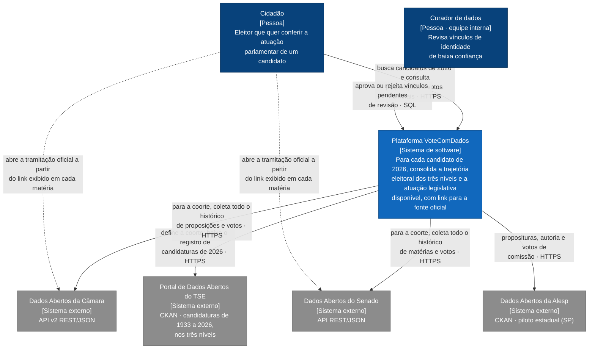
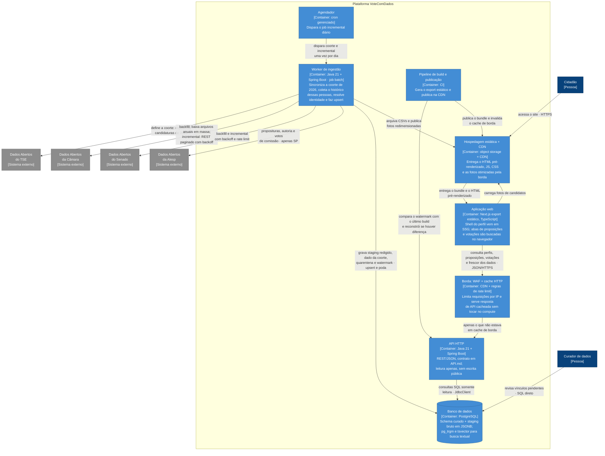
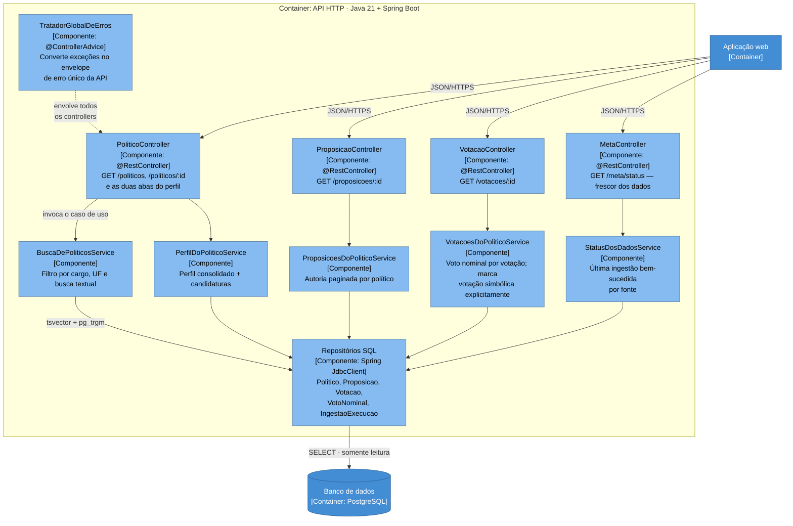
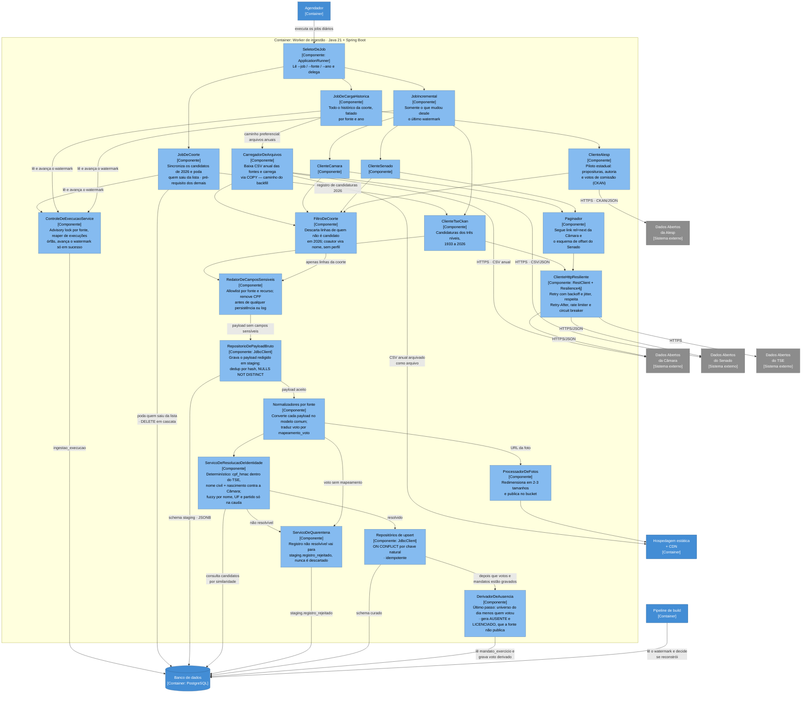

# VoteComDados — Arquitetura

Plataforma de transparência legislativa e eleitoral: para cada candidato da
eleição de 2026, toda a vida política disponível — trajetória eleitoral nos
três níveis e atuação legislativa até onde as fontes oficiais permitem.

**Escopo do MVP:** o sistema parte da lista de candidatos de 2026 (qualquer
cargo) e busca a vida política dessas pessoas — **trajetória eleitoral nos três
níveis** (via TSE) e **atuação legislativa federal e estadual em SP** (via
Câmara, Senado e Alesp). Demais assembleias e câmaras municipais ficam para a
próxima versão. Quem não é candidato em 2026 não tem registro pessoal na base.

**A cobertura é assimétrica** — entre níveis e entre estados — e isso é
modelado explicitamente, não escondido. Ver
[§ 5 Escopo do MVP](#escopo-do-mvp-e-o-que-existe-em-cada-nível).

Documentos relacionados: [BACKEND.md](BACKEND.md) · [FRONTEND.md](FRONTEND.md)
· [API.md](API.md) · [CUSTOS_INFRA_AWS.md](CUSTOS_INFRA_AWS.md) ·
[CUSTOS_INFRA_GCP.md](CUSTOS_INFRA_GCP.md) ·
[PLANO_DEVSECOPS_IAC.md](PLANO_DEVSECOPS_IAC.md) ·
[`db/schema.sql`](../db/schema.sql)

## Sobre a notação

Os diagramas seguem o modelo [C4](https://c4model.com) em três níveis
(Contexto, Container, Componente). São escritos como `flowchart` do Mermaid,
e não com a sintaxe `C4Context`/`C4Container` nativa — esta última ainda é
experimental no Mermaid e renderiza de forma inconsistente no GitHub, no
preview do VS Code e em outros visualizadores. A convenção C4 é preservada
no rótulo de cada elemento (`Nome` / `[Tipo: tecnologia]` / descrição) e no
código de cores: azul-escuro para pessoas, azul para containers, cinza para
sistemas externos.

Os containers são nomeados **por papel**, não por serviço de nuvem — a
decisão de provedor ainda está aberta. A tabela em
[§ Mapeamento para provedores](#mapeamento-para-provedores) liga cada
container ao equivalente em AWS e GCP.

---

## 1. Nível 1 — Diagrama de Contexto

Quem usa o sistema e com quais sistemas externos ele conversa.



As setas pontilhadas do cidadão para Câmara e Senado não são detalhe
decorativo: são o requisito de neutralidade em forma de arquitetura. O
sistema nunca é a autoridade final sobre um dado — ele sempre entrega ao
usuário o caminho de volta para a fonte oficial verificar.

---

## 2. Nível 2 — Diagrama de Containers

Como a plataforma se decompõe em unidades deployáveis.



Três pontos que o diagrama antigo (uma pilha linear) escondia e que valem
destaque:

- **Só existe uma camada de cache, e ela fica antes do compute.** Toda
  resposta da API é pública e idêntica para qualquer usuário, então a borda
  resolve o tráfego sem que a requisição chegue ao container. Não há cache
  in-memory atrás da API: a 1.000 visitas/dia ele ficaria tão frio quanto a
  borda, custando ~US$ 20/mês e uma dependência de runtime para não entregar
  nada (ver § 7).
- **O navegador fala direto com a API.** Como o frontend é export estático
  (ver [FRONTEND.md](FRONTEND.md)), não existe servidor Node em produção
  intermediando as chamadas. A CDN entrega arquivos; os dados das abas vêm
  de uma chamada do próprio navegador à API.
- **A API não escreve no banco.** Toda escrita é do worker. A API é
  estritamente somente-leitura, o que simplifica cache, permissões de banco
  (usuário com `SELECT` apenas) e o modelo de falhas.

### Mapeamento para provedores

| Container | AWS | GCP |
|---|---|---|
| Borda: WAF + cache HTTP | CloudFront + AWS WAF (rate-based rule) | Cloud CDN + Cloud Armor |
| API HTTP | ECS Fargate (service) + ALB | Cloud Run (service) |
| Worker de ingestão | ECS Task (RunTask) | Cloud Run Job |
| Agendador | EventBridge Scheduler | Cloud Scheduler |
| Banco de dados | RDS PostgreSQL | Cloud SQL for PostgreSQL |
| Hospedagem estática + CDN | S3 + CloudFront | Firebase Hosting + Cloud Storage |
| Pipeline de build | GitHub Actions | GitHub Actions |
| Segredos | Secrets Manager | Secret Manager |
| Observabilidade | CloudWatch | Cloud Logging + Monitoring |

Segredos e observabilidade ficam fora do diagrama por serem transversais a
todos os containers — desenhá-los criaria setas para tudo sem informação
nova. Detalhes de custo em [CUSTOS_INFRA_AWS.md](CUSTOS_INFRA_AWS.md) e
[CUSTOS_INFRA_GCP.md](CUSTOS_INFRA_GCP.md).

---

## 3. Nível 3a — Componentes da API HTTP



**Não há componente de cache dentro da API**, e a ausência é a decisão: o
cache vive inteiro na borda, antes de a requisição chegar aqui (§ 7). Cada
controller chama seu caso de uso e o caso de uso chama o repositório — a
resposta de um miss de borda é sempre uma consulta ao Postgres, e o alvo de
p95 da § 9 é dimensionado para isso, não para um acerto de cache que a
volumetria não produziria.

---

## 4. Nível 3b — Componentes do Worker de ingestão



---

## 5. Ingestão

### A coorte de 2026 define o escopo

**O sistema não carrega um recorte temporal de tudo — ele parte de uma lista de
pessoas.** A coorte é o conjunto de candidatos registrados na eleição de 2026,
a qualquer cargo, e para essas pessoas o objetivo é a vida política dentro do
escopo do MVP: trajetória eleitoral nos três níveis (via TSE) e atuação
legislativa federal e estadual-SP (ver a seção seguinte).

Isso inverte o pipeline: primeiro se descobre *quem* interessa (TSE), depois se
busca *o que* essas pessoas fizeram (Câmara/Senado). Consequências:

- **Quem não é candidato em 2026 não tem registro pessoal.** Não é filtro de
  exibição sobre uma base completa: a linha em `politico` não existe.
- **Todos os status entram** — inclusive indeferido e sub judice, com o status
  exibido. Omitir quem está em disputa judicial faria a plataforma parecer
  estar escondendo um candidato, e o andamento do registro é informação
  pública de interesse.
- **Qualquer cargo entra**, não só os federais. Um deputado federal que agora
  disputa o governo do estado é exatamente o caso em que o eleitor mais quer
  consultar o mandato — restringir a coorte a candidatos federais o removeria
  da plataforma no pior momento possível.
- **A coorte é móvel.** O registro de candidatura muda até a eleição
  (substituição, indeferimento, renúncia). O job `COORTE` roda diariamente e
  **poda** quem saiu da lista; `ON DELETE CASCADE` remove o histórico junto.
- **Coautores fora da coorte viram nome, não perfil.** A lista de autoria de
  uma matéria continua completa — omiti-los distorceria o registro — mas um
  nome numa lista não é um dossiê: sem perfil, histórico, foto ou página.

Ganho de LGPD relevante: o tratamento se limita a quem se apresenta ao
eleitorado, posição de minimização muito mais defensável do que um arquivo
permanente de todos os parlamentares.

> **Volumetria e sua consequência de produto:** medida no arquivo real do TSE
> em 31/08/2026, a coorte tem **20.809 candidaturas** — 7.748 a Deputado
> Federal, 11.223 a Estadual, 318 ao Senado e o restante nos cargos
> majoritários. O número ainda cresce enquanto a Justiça Eleitoral julga os
> registros, mas está bem abaixo das ~28 mil que este documento estimava. Das
> pessoas por trás dessas candidaturas, a
> **grande maioria nunca teve mandato legislativo** — as duas abas estarão vazias
> para elas. A flag `politico.possui_atuacao_legislativa` separa os dois casos:
> quem tem atuação é pré-renderizado estaticamente; para os demais a página
> responde "sem mandato legislativo anterior", que é uma resposta útil e
> definitiva, não um erro. Isso também resolve o problema de build de 28 mil
> páginas apontado na revisão (A1).

### Escopo do MVP e o que existe em cada nível

O MVP cobre **atuação legislativa federal e estadual em São Paulo**. As demais
26 assembleias e as câmaras municipais ficam para a próxima versão.

A **trajetória eleitoral continua nos três níveis**, inclusive municipal: vem
dos mesmos arquivos do TSE que já baixamos para montar a coorte, sem custo
adicional, e sem ela a linha do tempo do candidato ficaria com buracos —
"foi vereador em Campinas" some, e o perfil passa a mentir por omissão.

O quadro abaixo foi **verificado nas fontes**, não presumido:

| Nível | Trajetória eleitoral | Autoria de matérias | Voto nominal em plenário |
|---|---|---|---|
| **Federal — Câmara** | ✅ TSE | ✅ 1934+ | ✅ **só desde 2001** |
| **Federal — Senado** | ✅ TSE | ✅ 1991+ | ✅ **desde 1991**, mas 53% secretas |
| **Estadual — SP** | ✅ TSE | ✅ Alesp (1970+) | ⚠️ **só em PDF**; comissão desde 2006 |
| **Estadual — demais** | ✅ TSE | ⏳ fora do MVP | ⏳ fora do MVP |
| **Municipal** | ✅ TSE | ⏳ fora do MVP | ⏳ fora do MVP |

Quatro conclusões que moldam o produto:

1. **A trajetória eleitoral é uniforme e barata.** O TSE publica candidaturas
   de 1933 a 2026 em datasets padronizados, cobrindo os três níveis. É uma
   fonte só, já integrada para a coorte.
2. **Voto nominal de plenário só existe no nível federal — e as duas Casas
   diferem.** Câmara: verificado ano a ano, `votacoesVotos-2000` retorna 404 e
   `2001` retorna 200. Senado: alcança **1991**, dez anos a mais, e publica a
   bancada inteira em cada votação — mas **53% das votações são secretas**, e
   nelas a Casa registra quem participou, não como votou.
3. **Nem a melhor assembleia estadual publica voto de plenário em dado
   estruturado.** A Alesp tem 26 datasets (proposituras, autores, temas,
   tramitação) e, em votação, só `Votações nas Comissões` — voto individual
   **de comissão**, 226 mil votos desde fevereiro de 2006.

   A votação nominal de **plenário** existe, e a redação anterior deste
   documento errava ao dizer que não: a API do portal responde
   `/sessoes-plenarias/{id}/votacoes` (verificado em 31/08/2026), mas o
   registro de quem votou como vem dentro de um **PDF por votação**, com
   imagem embutida. Existe e não é legível por máquina — que é afirmação
   diferente de "não existe", e a diferença importa para o eleitor.
4. **Para os 5.570 municípios não há caminho que escale**, mesmo em versões
   futuras: sem padrão comum, sem votação nominal estruturada.

### Três situações de cobertura, três mensagens diferentes

`cobertura_fonte` distingue estados que a UI **não pode confundir**:

| Status | Significa | Mensagem ao eleitor |
|---|---|---|
| `DISPONIVEL` | Cobrimos, desde a data informada | Exibe o dado |
| `NAO_PUBLICADO_PELA_FONTE` | A Casa não publica; nenhuma engenharia resolve | "A Alesp não publica votos de plenário" |
| `FORA_DO_ESCOPO_MVP` | Pode existir, mas ainda não integramos | "Ainda não cobrimos esta assembleia" |

Dizer "não existe" quando a verdade é "não fizemos" seria desonesto — e o
inverso criaria expectativa de que basta esperar. Um `CHECK` no schema impede
a combinação incoerente (status fora do escopo com data de início), que faria
a UI afirmar cobertura inexistente.

A resolução usa **dois eixos**, e a diferença entre eles importa:

- **UF é precedência.** Uma linha com UF específica ganha da genérica.
  `ESTADUAL/SP/proposicao` resolve para a Alesp; `ESTADUAL/BA/proposicao` cai no
  fallback de UF nula e resolve para fora do escopo.
- **Casa é partição.** A esfera federal tem duas Casas, e quem foi deputado *e*
  senador tem duas coberturas legítimas, com datas de início diferentes —
  Câmara desde 2001, Senado desde 1991. Colapsá-las mentiria sobre uma das duas.

O segundo eixo veio de um defeito real, achado ao integrar o Senado:
`cobertura_fonte` era chaveada por `(esfera, uf, recurso)`, e a linha
`FEDERAL/voto_nominal` pertencia à Câmara. A plataforma dizia a senadores que o
voto nominal existia "desde 2001" — errado, e justamente na tabela que sustenta
a promessa de neutralidade. `casa_do_mandato(cargo, uf)` diz qual Casa
corresponde a cada mandato, e é o que faz um senador ler a cobertura do Senado.

> **O risco de neutralidade desta assimetria é o maior do projeto**, e o
> recorte do MVP o agrava: agora há assimetria entre níveis *e* entre estados.
> Um candidato paulista aparecerá mais documentado que um baiano, e um
> deputado federal mais atuante que um estadual — em ambos os casos por
> volume de publicação de dados, não por atuação política. Comparar dois
> candidatos sem esse contexto é comparar a transparência das Casas, não as
> pessoas. Por isso a cobertura é exibida junto do perfil, não em rodapé.

### Voto de comissão não é voto de plenário

O único voto individual estadual disponível é de comissão, e ele **não tem o
mesmo peso político** de uma deliberação de plenário. Por isso `votacao.ambito`
distingue `PLENARIO` de `COMISSAO`, e as duas nunca aparecem numa lista única
indiferenciada.

### O rótulo da Alesp: o que o spike do W12 corrigiu

A versão anterior desta seção dizia que o voto da Alesp é **texto livre**, com
455 rótulos distintos, e que a cauda iria para quarentena. A primeira metade
está certa e a conclusão estava errada.

A fonte publica **dois** campos de voto, e a documentação só descrevia o
segundo:

| Campo | O que é | Valores distintos |
|---|---|---|
| `<TipoVoto>` | **código**, documentado no PDF da própria Alesp | **8** |
| `<Voto>` | o que essa documentação chama de "descrição do tipo do voto" | **477** |

Os 477 textos — com erros de digitação ("proejto") e frases inteiras — são
descrições dos 8 códigos. **Mapear pelo código é usar a classificação da
fonte**; mapear pelo texto seria fabricar uma nossa, e deixaria ~1% dos votos
em quarentena permanente e crescendo, porque texto livre cresce.

Os dois são preservados: `voto_origem_codigo` guarda o código,
`voto_origem` o texto que a UI mostra em "registrado como".

| Código | Ocorrências | Vira | Por quê |
|---|---:|---|---|
| `F` Favorável (ao parecer) | 187.206 | `SIM` | |
| `P` Favorável ao projeto | 32.145 | `SIM` | |
| `C` Contrário (ao parecer) | 2.889 | `NAO` | |
| `T` Contrário ao projeto | 1.347 | `NAO` | |
| `S` Com o Voto em Separado | 2.130 | `VOTO_EM_SEPARADO` | Votou divergindo por escrito; a fonte não diz a direção, e há registros dos dois lados |
| `A` Abstenção | 164 | `ABSTENCAO` | |
| `B` Branco | 186 | `BRANCO` | A Alesp o conta separado da abstenção |
| `O` Outros | 0 | **quarentena** | É a própria fonte dizendo "não classificado" |

`VOTO_EM_SEPARADO` e `BRANCO` são valores novos de enum, e a alternativa —
quarentena — foi descartada por um motivo concreto: 2.316 registros alertando a
cada backfill quebrariam a regra de que **quarentena esperada é zero**, e
treinariam a ignorar o alerta.

### F e P podem ser opostos, e aí a quarentena é a resposta certa

`F` é favorável ao **parecer** do relator; `P`, favorável ao **projeto**. A Casa
usa um par ou o outro na mesma deliberação — F/C ou P/T —, e `C` e `T` nunca
coexistem (0 casos em 29.923 deliberações).

Mas quando F e P coexistem (**36 deliberações, 0,12%**) eles podem ser
opostos: há deliberação com "Favorável ao projeto e contrário ao parecer"
codificado como `P`, ao lado de linhas `F`. Gravar ambos como `SIM` diria que
votaram igual quem votou em lados opostos.

Essas deliberações vão **inteiras** para quarentena. É a regra do B5 um nível
acima: a ambiguidade não é do código, é da deliberação — e preferir não
classificar a classificar errado vale igual.

### Arquivos em massa para carga histórica, REST apenas para o incremental

**Esta é a decisão mais consequente do pipeline.** A Câmara publica os mesmos
dados que a API REST expõe registro a registro também como **arquivos anuais
completos**:

| Arquivo (exemplo de 2023) | Tamanho | Substitui |
|---|---|---|
| `proposicoes-2023.csv` | 52 MB | Paginação de `/proposicoes` + 1 detalhe por matéria |
| `proposicoesAutores-2023.csv` | 42 MB | 1 chamada a `/proposicoes/{id}/autores` por matéria |
| `proposicoesTemas-2023.csv` | 2,7 MB | 1 chamada de temas por matéria |
| `votacoes-2023.csv` | 6,7 MB | Paginação de `/votacoes` |
| `votacoesVotos-2023.csv` | 43 MB | 1 chamada a `/votacoes/{id}/votos` por votação |
| `deputados.csv` | 1,4 MB | Paginação de `/deputados` |

São atualizados diariamente, não são dumps congelados.

Usar a API REST para a carga histórica significaria **centenas de milhares de
requisições** (três por proposição, uma por votação) contra uma API pública
que precisa ser tratada com rate limit — padrão N+1 aplicado a um sistema de
terceiros — e o problema só piora com histórico completo em vez de uma janela
curta. Com os arquivos, o backfill inteiro são **algumas centenas de
downloads** (um por ano e por recurso), carregados com `COPY`, e a
transformação acontece em SQL dentro do banco (ELT).

Isso muda mais que o tempo de execução: remove retry, backoff e circuit
breaker do caminho crítico da carga histórica, e torna o reprocessamento
completo viável em minutos — o que sustenta a estratégia de staging.

A API REST fica reservada ao **delta diário**, onde o volume é pequeno e o
padrão request/response é adequado.

> **A coorte não reduz o download, reduz o que se guarda.** Os arquivos são
> anuais e contêm todos os parlamentares — não há como pedir "só estes 300".
> Baixa-se o ano inteiro e **filtra-se na carga**, mantendo no schema curado
> apenas o que pertence à coorte. O ganho é em armazenamento e em superfície
> de dados pessoais, não em tráfego.

Por isso os CSVs em massa são arquivados **no object storage**, não em
`staging.payload_bruto`: o arquivo é reproduzível e imutável, guardá-lo como
JSONB linha a linha custaria caro sem ganho. O staging JSONB fica para os
payloads do incremental via REST, que não têm essa propriedade.

### Modelo de execução

O worker **não é um serviço com fila**: é um job batch parametrizado que
executa, persiste e sai.

```
java -jar ingestion.jar --job=coorte                            # sincroniza e poda a lista de 2026
java -jar ingestion.jar --job=backfill --fonte=camara --ano=2015 # histórico da coorte, por fatia
java -jar ingestion.jar --job=incremental                        # delta diário
```

O backfill é fatiado por `(fonte, ano)`. Essa granularidade é o que
substitui um broker de mensagens: se o processo morre no meio, perde-se no
máximo o progresso de uma fatia, e reexecutá-la é seguro porque todo
`INSERT` é `ON CONFLICT` (idempotente). Um broker daria durabilidade por
página em vez de por fatia, ao custo de um componente a mais para operar —
troca que não se paga nesta escala.

**O job `COORTE` roda antes de tudo e é pré-requisito dos demais:** sem a
lista de candidatos não há como saber o que filtrar. Quando ele adiciona
alguém novo (registro deferido depois, substituição), o backfill precisa rodar
de novo para aquela pessoa — barato, porque os CSVs já estão no object storage
e o filtro é uma consulta SQL.

### Exclusão mútua: uma execução por fonte

Duas execuções simultâneas na mesma fonte corromperiam o watermark: ambas
leem o mesmo marcador inicial, e a última a terminar pode gravar um valor
**anterior** ao da outra. A idempotência dos upserts não protege contra isso —
o dado não fica duplicado, fica **faltando**.

Três camadas, porque cada uma cobre a falha da anterior:

1. `pg_try_advisory_lock(hashtext('ingestao:' || fonte))` no início do job.
   Não obteve o lock, encerra com log — não enfileira.
2. Índice único parcial em `ingestao_execucao (fonte) WHERE status =
   'EM_ANDAMENTO'` — rede de segurança no banco, para quando o processo morre
   e o advisory lock é liberado pelo fim da sessão.
3. **Reaper** no início de cada job, marcando como `FALHA` execuções
   `EM_ANDAMENTO` mais antigas que o timeout previsto. Sem ele, um processo
   morto por OOM ou evicção travaria a fonte permanentemente por causa da
   camada 2.

O watermark é gravado com `GREATEST(novo, atual)`: nunca retrocede.

### Staging bruto, com redação obrigatória de dados pessoais

Cada payload é gravado como JSONB no schema `staging` **antes** da
normalização, com dedup por hash — bugs de normalização são descobertos
semanas depois, e sem staging a correção exigiria repetir a coleta.

**O payload nunca é gravado como veio da fonte.** O dataset de candidaturas do
TSE contém `NR_CPF_CANDIDATO`; persistir o original criaria uma base com o CPF
em claro de ~28 mil candidatos. A escrita passa por uma **allowlist** de campos
por `(fonte, recurso)` — allowlist e não denylist, para que um campo novo na
origem entre como ignorado e não como vazamento. Os campos removidos ficam
registrados em `campos_redigidos`, para auditoria.

Retenção de 90 dias, com limpeza junto do job incremental.

### Quarentena: falhar visível em vez de descartar em silêncio

`voto_nominal.politico_id` tem FK obrigatória para `politico`. Um voto cujo
parlamentar ainda não foi vinculado — suplente que assumiu no meio da
legislatura, eleito antes da janela de candidaturas carregada, ou match fuzzy
pendente de curadoria — viola essa FK.

Tratar isso com `ON CONFLICT DO NOTHING` ou try/catch por registro faria o
voto **desaparecer sem rastro**. Numa plataforma de transparência, omitir um
voto silenciosamente é pior que falhar alto: o erro é indetectável para o
usuário e corrói exatamente a credibilidade que justifica o projeto.

Então todo registro não resolvível vai para `staging.registro_rejeitado` com
motivo, detalhe e payload — um item de trabalho visível, reprocessável. O
número de registros em quarentena por fonte e motivo é **métrica de negócio
com alerta**, e o valor esperado é zero.

**Com uma exceção, e ela é decisiva:** quem não é candidato em 2026 também
falha o vínculo, e não é defeito. Uma votação nominal traz ~398 linhas, a
maioria de parlamentares fora da coorte — se caíssem no mesmo motivo, a métrica
nasceria com dezenas de milhares de linhas e o alerta seria inútil no primeiro
dia. Por isso `FORA_DA_COORTE` é motivo próprio, gravado **uma vez por
parlamentar** (não por voto) e **contado sem alertar**. A consulta de alerta
exclui esse motivo explicitamente; o índice único parcial impede que
reprocessar multiplique as linhas.

Ordem de ingestão explícita, para minimizar a quarentena por construção:
cadastro de parlamentares → **histórico de situação (exercício/licença)** →
proposições e votações → votos e autoria → **derivação de ausência e licença**.

### Ausência e licença são calculadas, não ingeridas

Nenhuma fonte publica "faltou". `votacoesVotos` lista apenas quem registrou
voto: em 2026 há cinco rótulos (`Sim`, `Não`, `Abstenção`, `Artigo 17`,
`Obstrução`) e mediana de **398 linhas para 513 cadeiras**. Exibir só isso
omitiria a ausência em silêncio — um parlamentar que faltou a 40% das votações
apareceria com histórico aparentemente limpo.

A derivação é o último passo do pipeline, e usa `mandato_exercicio`, carregada
de `/deputados/{id}/historico` (situação com data: `Exercício`, `Licença`,
`SUPLENCIA`, `CONVOCADO`, `FIM_MANDATO`, `VACANCIA`):

| Situação na data | Registrou voto? | Resultado |
|---|---|---|
| `EXERCICIO` | sim | o voto declarado, com `voto_origem` |
| `EXERCICIO` | não | `AUSENTE`, derivado |
| `LICENCA` | não | `LICENCIADO`, derivado |
| demais | — | **nenhuma linha** — não é ausência, é não ser parlamentar naquele dia |

Três garantias sustentam isso no banco, e cada uma tem invariante executável:

- `origem_registro` (`FONTE` | `DERIVADO`) marca a diferença, e a API a expõe:
  apresentar cálculo nosso como registro oficial seria o mesmo erro que
  `voto_origem` existe para impedir.
- `mandato_exercicio` proíbe períodos sobrepostos por (político, casa) via
  `EXCLUDE`. Sem isso, alguém poderia constar em exercício e em licença no
  mesmo dia, e a derivação marcaria como falta o que era licença.
- O vocabulário da fonte é inconsistente (`Exercício` capitalizado ao lado de
  `SUPLENCIA` em caixa alta, além de nulos), então passa por
  `mapeamento_situacao` — versionada como dado, igual ao `mapeamento_voto`. O
  que não estiver mapeado vai para quarentena (`SITUACAO_NAO_MAPEADA`), nunca
  é adivinhado.

### Watermark: por que a falha não pode avançar o marcador

O job incremental pergunta "o que mudou desde a última vez?". Se a resposta
vier de um marcador atualizado no início da execução, uma falha no meio do
caminho faz o próximo ciclo pular silenciosamente tudo o que não foi
processado — o dado nunca chega, e nada acusa a lacuna.

Por isso o watermark vive em `ingestao_execucao` e **só avança quando a
execução termina com `status = 'CONCLUIDA'`**. O job incremental lê
`MAX(watermark_novo)` entre execuções bem-sucedidas daquela fonte. O
resultado de uma falha é reprocessar uma janela já processada (barato e
inofensivo, graças à idempotência), nunca perder uma janela.

### Resiliência

Retry com backoff exponencial + jitter, respeito a `Retry-After` e aos
cabeçalhos de limitação, rate limiter por fonte e circuit breaker para não
insistir contra uma API de governo já instável. As virtual threads do
Java 21 tornam trivial disparar centenas de chamadas concorrentes — o rate
limiter existe justamente para que essa facilidade não vire um problema
para a origem.

### Staging bruto

Cada payload coletado é gravado como JSONB no schema `staging` **antes** da
normalização, com deduplicação por hash: se o payload não mudou desde a
última coleta, nada novo é armazenado.

O motivo é concreto: bugs de normalização são descobertos semanas depois.
Sem staging, corrigir um deles exige repetir a coleta completa contra APIs
lentas e instáveis (as ~200h de worker do mês piloto). Com staging, a
correção é reprocessamento local, em minutos. O custo é armazenamento
adicional no Postgres, contido pelo dedup e por uma política de retenção de
90 dias para o histórico bruto.

---

## 6. Resolução de identidades e curadoria

Desafio: Câmara, Senado e TSE não compartilham identificador comum, e os
nomes variam (nome de urna vs. nome parlamentar vs. nome civil).

1. **Determinística dentro do TSE:** `cpf_hmac` liga candidaturas da mesma
   pessoa entre eleições diferentes. É a única chave estável de pessoa que o
   TSE publica, e é para isso — e só para isso — que a coluna existe.
2. **Determinística contra a Câmara:** **nome civil normalizado + data de
   nascimento**. O CPF não serve aqui: `deputados.csv` tem a coluna, mas ela
   está vazia nas 7.889 linhas (verificado em 30/08/2026). Os dois campos que
   funcionam estão 100% preenchidos da legislatura 54 (2011) em diante, o que
   deixa o caso geral fora da fila de curadoria.
3. **Probabilística (fuzzy), só na cauda:** quando falta data de nascimento ou
   o nome civil diverge, compara nome normalizado (`unaccent` + trigram) e
   exige também coincidência de UF e partido na janela eleitoral.

Casamentos abaixo do threshold (ex.: similaridade < 0,85) entram com
`revisado_manualmente = false` e **não são exibidos como vínculo
confirmado** até passarem por curadoria humana — é o que evita fundir dois
homônimos de UFs diferentes num único perfil, o tipo de erro que destruiria
a credibilidade da plataforma.

No MVP a curadoria é feita por consulta SQL direta ao banco pelo curador — o
próprio owner (daí o ator no nível 2), sem interface própria. Uma tela interna
de aprovação é evolução natural, mas adicionaria escopo e uma linha de custo
hoje não orçada.

**SLA:** a fila é zerada antes do lançamento e revisada semanalmente depois,
priorizando quem tem mandato federal e quem disputa cargo federal. Com um
curador único, o risco não é qualidade, é gargalo — mitigado por fazer o caso
geral casar deterministicamente e deixar à curadoria apenas a cauda.

Toda decisão é auditável em `identificador_externo`: `metodo_resolucao`,
`score_confianca` e — para a decisão humana, que é a discricionária —
`revisado_por` e `revisado_em`, com `CHECK` que impede marcar como revisado sem
dizer quem e quando. Nada é sobrescrito silenciosamente.

---

## 7. Armazenamento e cache

- **PostgreSQL** é a fonte de verdade, com dois schemas: o curado
  (`public`) e o bruto (`staging`). Busca textual com `pg_trgm` e
  `tsvector` já embutidos em [`db/schema.sql`](../db/schema.sql). Suficiente
  para dezenas de milhares de políticos e proposições; Elasticsearch só se a
  busca virar gargalo medido.
- **Cache HTTP na borda** é a camada **primária**, e não uma otimização
  posterior. Todas as respostas da API são públicas e idênticas para qualquer
  usuário — o caso ideal de cache de CDN. Com
  `Cache-Control: public, s-maxage=86400, stale-while-revalidate=604800,
  stale-if-error=604800`, a maior parte do tráfego é resolvida na borda sem
  tocar em compute, e `stale-if-error` mantém o site respondendo com conteúdo
  levemente velho mesmo com o backend fora do ar. O TTL acompanha o ritmo do
  dado (diário), não um valor de reflexo — ver § 9: a 1.000 visitas/dia, um
  TTL de minutos não cacheia nada.
> Com TTL de um dia, o cache **sem** invalidação ativa deixa de ser correto por
> si só: é a invalidação explícita no rebuild que o torna correto. As duas
> coisas andam juntas — esticar o TTL sem invalidar exibiria dado velho por
> tempo perceptível.

### Por que não há cache in-memory atrás da API

O desenho original tinha um Redis em cache-aside entre a API e o banco. Ele
foi **removido**, e o motivo é a volumetria, não elegância.

Com ~1.000 visitas/dia espalhadas por milhares de páginas, a chance de duas
requisições pedirem a mesma coisa dentro da vida útil de uma entrada é
desprezível. O Redis ficaria **tão frio quanto a borda** — e um cache frio não
é neutro: custava ~US$ 20/mês, era um SPOF (o B2 da revisão: health check
agregado derrubando a frota, `@Cacheable` falhando fechado) e obrigava a API a
carregar um `CacheErrorHandler` de fail-open só para sobreviver à queda de algo
que não entregava nada.

O que sobra é mais simples e mais robusto: **a borda é a única camada de
cache**, e a API responde todo miss indo ao Postgres. O alvo de p95 da § 9 é
dimensionado para esse caminho.

O gatilho para reabrir a decisão é explícito: se a volumetria crescer a ponto
de a borda não absorver o tráfego, o cache volta — mas do lado certo, medindo
antes.

---

## 8. Frescor dos dados como requisito de transparência

O shell do perfil é estático e só muda no próximo rebuild; as abas são
dinâmicas. Isso cria a possibilidade de o usuário ver uma página gerada há
dois dias — e uma plataforma de transparência não pode ser ambígua sobre a
idade do que mostra.

Por isso `GET /meta/status` (ver [API.md](API.md)) expõe a última ingestão
bem-sucedida por fonte, lida de `ingestao_execucao`, e a aplicação web a
consulta **em tempo de execução**. O indicador de frescor mostrado ao
usuário reflete o estado real da ingestão, não a data do build do HTML —
mesmo que o shell esteja defasado.

### A ingestão não para em ano eleitoral

Existe a intuição de que a base congela alguns meses antes da eleição, porque
candidatos precisariam se afastar. **Ela não vale para o Legislativo.** A regra
de desincompatibilização (art. 14 § 6º da Constituição e LC 64/1990) alcança
chefes do Executivo que disputam outro cargo; deputados e senadores mantêm o
mandato e continuam votando até 31/01/2027, inclusive quando são candidatos.

Verificado no dado, não presumido: `votacoes-2026.csv` registra **308 votações
de plenário depois de maio/2026** — 107 em junho, 128 em julho e 73 em agosto —
e o arquivo é atualizado diariamente.

Congelar a ingestão esconderia exatamente os votos dados **durante a campanha**,
que é quando o eleitor mais tem motivo para consultá-los. A coorte tampouco está
estável: o registro de candidaturas segue sujeito a indeferimento, substituição
e renúncia até a eleição, então o job `COORTE` continua pelo mesmo motivo.

O que o contexto de piloto autoriza é relaxar o **SLA de frescor**, não desligar
a ingestão. A ingestão diária é **melhor esforço, não SLA contratado**: D+1 sem
urgência, sem alerta noturno, e uma falha de um dia se recupera sozinha no dia
seguinte — o watermark só avança em sucesso e os upserts são idempotentes, então
o job seguinte reprocessa a janela perdida sem intervenção. O alerta só dispara
na **segunda falha consecutiva** (§ 9): um dia perdido é ruído, dois são
sintoma.

Quem consulta não fica no escuro enquanto isso: `GET /meta/status` expõe a
última ingestão bem-sucedida por fonte, então uma defasagem real aparece na
interface como defasagem, não como silêncio.

---

## 8b. Dados abertos: devolver o dado consolidado

A plataforma faz uma afirmação que ninguém consegue conferir de fora: **"este
deputado é esta candidata"**. TSE e Casas não compartilham identificador comum,
então todo vínculo é interpretação nossa — e uma plataforma de transparência
que não pode ser auditada está pedindo fé, não mostrando dado.

Por isso o banco curado é publicado de volta, como dado aberto. Quem discordar
de um vínculo baixa o arquivo, refaz o cruzamento e aponta o erro.

O recorte publicável vive no schema `dados_abertos`, como **views** — não como
um script de export com colunas listadas à mão. A diferença importa: assim a
exclusão de dado pessoal é verificada por invariante (T48), e não prometida em
README. Ficam de fora `cpf_hmac`, a identificação de quem fez a curadoria, o
staging bruto, a quarentena e os históricos internos de alteração — nada disso
serve à auditoria do cruzamento.

Três decisões que fazem o pacote servir para o que existe:

1. **Instantâneos datados e imutáveis.** `dados-abertos/AAAA-MM-DD/`, nunca
   sobrescrito (o script recusa). Uma análise publicada precisa continuar
   verificável, e um arquivo que muda embaixo de quem o citou não é evidência.
   `latest` é conveniência, não endereço de citação.
2. **O manifesto é parte do dado.** Data, volumetria, última ingestão por fonte
   e — deliberadamente — quantos vínculos vieram de similaridade e **quantos
   desses ainda não passaram por revisão humana**. Publicar esse número é
   desconfortável, e é exatamente por isso que ele vai: some-lo tornaria o
   pacote uma peça de marketing.
3. **`origem_registro` viaja junto.** Sem ele, quem baixasse o arquivo leria
   ausência calculada por nós como registro oficial da Casa — o mesmo erro que
   `voto_origem` existe para impedir, agora fora do nosso controle editorial.

As tabelas de tradução (`mapeamento_voto`, `mapeamento_situacao`) vão no pacote
porque são a parte **editorial** do trabalho: é ali que está registrado o que
decidimos que cada rótulo da fonte significa. Sem elas o dump seria conferível
só na aritmética, não no julgamento.

Geração: `ExportadorDeDadosAbertos`, no worker, ao fim de cada ingestão
bem-sucedida. Houve um script shell equivalente, removido em 31/08/2026: duas
implementações do mesmo pacote é a classe de divergência silenciosa que este
projeto passa o tempo todo combatendo. O recorte continua definido pelas views,
que é o que o invariante T48 verifica — a implementação só transporta. Licença CC BY 4.0 — o dado de origem é público e
pertence aos órgãos que o publicam; o que licenciamos é a consolidação. Custo:
alguns arquivos CSV no object storage já orçado.

---

## 9. Requisitos não funcionais

- **Performance:** TTFB **p95** < 200ms em rotas cacheadas; **p95** < 500ms em
  consultas diretas ao Postgres sem cache quente. Medido na borda, não dentro
  do container. O HTML do perfil sai da CDN, sem compute no caminho crítico —
  é por isso que o alvo de rota cacheada continua plausível mesmo com a
  região de compute em `us-east-1` (decisão de custo sobre latência,
  02/09/2026, ver [CUSTOS_INFRA_AWS.md § Premissas](CUSTOS_INFRA_AWS.md#premissas)):
  a resposta cacheada vem da borda do CloudFront, próxima do usuário, não da
  região de origem. O alvo de 500ms para consulta direta ao Postgres é onde
  a distância até `us-east-1` mais pesa, e é o número a revisar com medição
  real antes de assumir que segue valendo.
- **Volumetria do piloto:** ~1.000 visitantes/dia, média de ~0,01 req/s. O
  dimensionamento parte desse número; um pico de 100× vindo de repercussão em
  imprensa é absorvido pela CDN sem tocar em compute.
- **Acessibilidade:** mobile-first, WCAG 2.1 AA (contraste, navegação por
  teclado, alternativa textual em fotos). Detalhes em
  [FRONTEND.md](FRONTEND.md).
- **Neutralidade:** nenhum ranking ou score editorial — apenas fatos com
  fonte oficial linkada. Votações `SIMBOLICA` são sinalizadas como "sem
  registro nominal individual", nunca como lista vazia sem explicação.
- **Disponibilidade:** a indisponibilidade de uma API de governo degrada
  apenas o frescor (o job seguinte recupera a janela), não a plataforma.

### TTL de cache: o alvo p95 depende da volumetria, não do bom senso

O par (p95, 1.000 visitas/dia) tem uma consequência que contraria a intuição:
**um TTL curto não cacheia nada.** Com o tráfego espalhado por milhares de
páginas, a chance de duas visitas à mesma URL caírem na mesma janela de cinco
minutos é desprezível, e quase toda requisição vira miss — o p95 observado
seria o do banco, não o da borda.

Como o dado muda no máximo uma vez por dia, o TTL acompanha o dado:

```
Cache-Control: public, s-maxage=86400, stale-while-revalidate=604800,
               stale-if-error=604800
```

com invalidação explícita no rebuild. O `stale-if-error` longo é também a
principal mitigação do single-AZ descrito abaixo.

### Continuidade: single-AZ, com backup e restore testados

| | Alvo | Como |
|---|---|---|
| **RPO** | 5 min | PITR do backup automático gerenciado |
| **RTO** | 4 h | restore de snapshot em instância nova |
| **RTO catastrófico** | ~1 dia útil | reingestão completa a partir dos CSVs arquivados |
| Retenção | 7 dias de PITR + snapshot mensal | — |
| Teste de restore | antes do lançamento e a cada trimestre | restore não testado não é backup |

O custo de single-AZ, dito sem eufemismo: **a janela de manutenção do provedor
é indisponibilidade da API.** Isso só é aceitável porque o shell do perfil é
estático e o `stale-if-error` serve conteúdo levemente velho — o site continua
de pé, e o que degrada são as abas dinâmicas.

### Operação: um operador, sob demanda, sem plantão

Não há turno de plantão; o owner atua quando algo quebra. Isso define o
desenho de alertas — **poucos, acionáveis e nenhum de madrugada**:

- ingestão falhou **dois dias seguidos** (um dia se recupera sozinho);
- quarentena com motivo alertável acima de zero;
- 5xx sustentado na borda.

Nada além disso notifica. A recuperação automática é o job do dia seguinte,
idempotente por construção. É também o argumento final contra Kubernetes: não
há operador para pagar seu custo cognitivo.

### Orçamento

O teto de ~US$ 170/mês não é rígido, mas **gasto precisa de aprovação antes de
ser provisionado**. Regra operacional: nenhum recurso novo sem estar listado e
aprovado; alarme de billing em 50%, 80% e 100% do previsto; e nada que escale
com tráfego sem limite superior — teto de tasks, limite de requisições no WAF
e na CDN.

Com a remoção do Redis e a inclusão de backup, o plano original (piloto +
mês de uso) fechava **abaixo** do teto. A decisão de ir direto para produção
e ficar só 45 dias (sem piloto — ver
[CUSTOS_INFRA_AWS.md](CUSTOS_INFRA_AWS.md)) mudou essa conta para ≈US$ 269
nos 45 dias, ~5% acima de um teto equivalente de ~US$ 255 para o mesmo
período (US$ 170/mês × 1,5) — a folga que cobria WAF e backup no plano de
dois meses não sobrava mais ao pular a fase piloto. A migração de região
decidida em seguida (`sa-east-1` → `us-east-1`, custo sobre latência — ver
[CUSTOS_INFRA_AWS.md](CUSTOS_INFRA_AWS.md#premissas)) trouxe o total de
volta para ≈US$ 236, **~7% abaixo** do teto escalado. O plano de GCP
([CUSTOS_INFRA_GCP.md](CUSTOS_INFRA_GCP.md)) segue como referência de
comparação, não como implementação — ver
[PLANO_DEVSECOPS_IAC.md § 3](PLANO_DEVSECOPS_IAC.md#3-decisões-do-owner).

### Health checks: o que pode e o que não pode derrubar a frota

O load balancer aponta para **`/actuator/health/readiness`**, e esse grupo
contém **apenas o Postgres** — a única dependência sem a qual a API
genuinamente não funciona.

O detalhe importa porque `/actuator/health` (agregado) inclui **todos** os
indicadores registrados, por padrão. Usá-lo no health check produz falha em
cascata: uma dependência lateral cai → todos os containers reportam `DOWN` → o
balanceador tira todos de rotação → **indisponibilidade total do site por causa
de algo que só deveria degradar latência**, com os containers reiniciando em
loop sem conseguir passar a verificação.

A remoção do Redis (§ 7) eliminou a dependência lateral que motivou o achado,
mas a regra continua valendo — e vale mais ainda para o que vier depois:

- `/actuator/health/liveness` — só o processo. Nunca verifica dependência
  externa: liveness que falha por causa de rede causa reinício em loop.
- `/actuator/health/readiness` — apenas Postgres.
- **Grupo explícito, nunca o agregado.** Toda dependência nova entra fora dos
  dois grupos por padrão; incluí-la é decisão consciente, não efeito colateral
  de adicionar uma biblioteca.

## 10. Segurança e dados pessoais

- **CPF: HMAC com pepper, não hash simples.** O campo é `cpf_hmac`
  (HMAC-SHA256 com chave no gerenciador de segredos), porque o espaço de CPFs
  válidos (~10¹⁰ com dígito verificador) é enumerável por força bruta em
  segundos: um SHA-256 puro seria, na prática, equivalente a guardar o CPF.
  A coluna é opcional e descartável — depois da resolução de identidade, o
  vínculo vive em `identificador_externo` e o `cpf_hmac` pode ser zerado.
- **O CPF tem exatamente um uso, e não é o que se imagina.** `deputados.csv`
  da Câmara traz uma coluna `cpf`, mas ela está **vazia nas 7.889 linhas**
  (verificado em 30/08/2026) — o CPF não serve, e nunca serviria, para casar
  TSE↔Câmara. Esse casamento usa **nome civil + data de nascimento**, campos
  presentes nas duas fontes e 100% preenchidos da legislatura 54 (2011) em
  diante. Sobra ao `cpf_hmac` um único papel: ligar candidaturas da mesma
  pessoa entre eleições diferentes **dentro do TSE**, onde é a única chave
  estável de pessoa. Montada a trajetória eleitoral, o job `COORTE` expurga a
  coluna — ela é transitória, não permanente.
- **Redação obrigatória antes de persistir ou logar.** O dataset do TSE traz
  `NR_CPF_CANDIDATO`; nenhum payload de origem é gravado em staging ou escrito
  em log sem passar pela allowlist de campos (ver § 5). O appender de log
  aplica o mesmo mascaramento — o worker loga payload em caso de erro, e é o
  caminho mais fácil de vazamento acidental.
- **Escopo dos dados:** apenas informação pública de atuação
  parlamentar e candidatura, oriunda de portais oficiais de dados abertos.
  Não há dado de eleitor, e a plataforma não coleta cadastro de usuário —
  o que reduz drasticamente a superfície de LGPD.
- **Menor privilégio no banco:** a API usa credencial com `SELECT` apenas;
  escrita é exclusividade do worker. Um comprometimento da API pública não
  permite alterar dado histórico.
- **Proteção contra abuso na borda:** a API é pública e anônima, e seu
  endpoint mais barato de atacar é o mais caro de servir — `?q=` executa busca
  trigram com contagem, e variar o termo gera chave de cache sempre nova,
  contornando o cache por construção. Rate limiting por IP no WAF (antes de
  qualquer compute), `statement_timeout` na credencial de leitura, e limite
  validado no servidor para `pageSize` e para o comprimento de `q`.
- **Segredos** vivem no gerenciador do provedor e são injetados na
  execução, nunca versionados.
- **Superfície pública mínima:** a API é somente leitura, sem autenticação
  de usuário final e sem endpoint de escrita exposto.

## 11. Decisões de arquitetura

| Decisão | Alternativa descartada | Gatilho para revisar |
|---|---|---|
| Escopo pela coorte de candidatos de 2026, com histórico completo | Janela temporal fixa (ex.: 10 anos) de todos os parlamentares | Após a eleição: decidir se a coorte vira "eleitos de 2026" ou se abre para 2030 |
| Trajetória eleitoral pelos três níveis via TSE | Só cargos federais | — (fonte única e barata; sem motivo para restringir) |
| Alesp como único conector estadual no MVP | Integrar as 27 assembleias; ou nenhuma | Próxima versão: piloto mostrar se o esforço por assembleia escala |
| Voto de plenário da Alesp fica de fora | OCR dos PDFs de votação nominal | Reconhecer texto de imagem para depois afirmar como alguém votou é acrescentar uma camada de erro justamente onde o produto não pode errar |
| Trajetória eleitoral municipal mantida no MVP | Cortar junto com a atuação municipal | — (vem dos mesmos arquivos do TSE; cortar custaria trabalho e criaria buracos na linha do tempo) |
| Cobertura com três status distintos | Booleano "tem ou não tem" | — (não revisar: "não existe" e "não fizemos" são mensagens diferentes) |
| Voto de comissão separado de plenário (`ambito`) | Lista única de votações | — (não revisar: é garantia de não distorção) |
| Sem atuação legislativa municipal | Integrar câmaras via SAPL/Interlegis | Surgir fonte agregada com votação nominal municipal |
| Coorte inclui todos os cargos e todos os status de registro | Só candidatos federais; só deferidos | Volume de candidatos sem atuação federal tornar a busca ruim |
| Coautor fora da coorte gravado como nome, sem perfil | Omitir; ou manter perfil completo | Necessidade de comparação histórica com não-candidatos |
| CSVs em massa arquivados em object storage | Guardar cada linha como JSONB em staging | — (o arquivo é imutável e reproduzível) |
| Arquivos em massa no backfill, REST no incremental | REST para tudo (N+1 contra API de terceiro) | Fonte deixar de publicar arquivos, ou exigir frescor intradiário |
| Job batch fatiado por `(fonte, ano)` | Fila/broker com unidade por página | Fatia anual passar de poucas horas ou retrabalho ficar caro |
| Cache HTTP na borda como camada primária, TTL de 1 dia | TTL curto (5 min) | Dado passar a mudar mais de uma vez por dia |
| Redis removido: a 1.000 visitas/dia ele ficaria frio | Manter como cache opcional fail-open | Volumetria subir a ponto de a borda não absorver o tráfego |
| Ingestão diária até 31/01/2027, em melhor esforço | Congelar a base em maio/2026; ou SLA contratado de frescor | Fim da legislatura; ou frescor virar requisito de produto |
| Single-AZ com PITR: RPO 5 min, RTO 4 h | Multi-AZ | Plataforma deixar de ser piloto, ou indisponibilidade custar reputação |
| `AUSENTE` e `LICENCIADO` derivados da lista de exercício | Ingerir só quem votou (omite a ausência em silêncio) | — (não revisar: sem isso a plataforma mente por omissão) |
| Histórico de alteração registrado, não publicado | Versionar voto no contrato público | Demanda editorial por mostrar a correção ao leitor |
| `cpf_hmac` expurgado ao fim do `COORTE` | Manter enquanto durar a coorte | Surgir uso de casamento que dependa dele |
| Curador único (o owner), fila zerada antes do lançamento | Curadoria distribuída com SLA por turno | Fila deixar de caber numa revisão semanal |
| CI reconstrói comparando watermark com `build-info.json` (pull) | Webhook do worker para o CI (push); ou Outbox com broker | Latência de rebuild se tornar inaceitável para o produto |
| Projeção `perfil_leitura` para a página de perfil | Três consultas normalizadas por visita | Projeção divergir da origem, ou o perfil ganhar dado por usuário |
| Golden files das fontes no repositório | Testar mapeamento só com dado sintético | — (não revisar: foi dado real que revelou o B8) |
| Dados abertos publicados desde o piloto, em instantâneos datados imutáveis | Adiar para depois da eleição; ou publicar só o `latest` mutável | — (não revisar: dado citável que muda embaixo de quem citou não é evidência) |
| Recorte publicável como views (`dados_abertos`) | Script de export com colunas à mão | — (não revisar: é o que torna a exclusão de dado pessoal testável) |
| Quarentena explícita para registro não resolvível | Descartar ou falhar o job inteiro | Volume em quarentena virar rotina em vez de exceção |
| `voto_origem` preservado ao lado do enum | Confiar só no enum normalizado | — (não revisar: é garantia de auditoria) |
| Staging bruto em JSONB, com redação por allowlist | Normalizar em memória; staging em object storage | Volume bruto crescer além do storage previsto |
| PostgreSQL para busca textual | Elasticsearch desde o início | Latência de busca medida acima do alvo de 500ms |
| `JdbcClient` com SQL à mão | jOOQ com codegen | Haver JDK local ou CI com Docker-in-Docker (o codegen exige banco durante o build) |
| Frontend em export estático | SSR em compute dedicado | Necessidade de personalização por usuário ou dado sempre-fresco no shell |
| Curadoria por SQL direto | Interface interna de aprovação | Volume de vínculos pendentes tornar o SQL manual inviável |
| API somente leitura | API com endpoints de escrita/admin | Surgir necessidade de edição pela aplicação |
| ECS/Cloud Run em vez de Kubernetes | EKS/GKE | Portfólio crescer para muitos serviços, ou mandato organizacional |

## 12. Limitações conhecidas

- **Shell estático defasado:** dados de perfil (foto, partido) só mudam no
  rebuild seguinte. Mitigado pelo indicador de frescor da § 8, não
  eliminado.
- **Vínculos pendentes invisíveis:** um político cujo casamento ficou abaixo
  do threshold aparece com dados incompletos até a curadoria — decisão
  deliberada de errar para o lado de omitir em vez de afirmar vínculo
  incerto.
- **Votos nominais não existem antes de 2001** na fonte da Câmara. Candidato
  com mandato anterior a isso terá autoria e nunca terá votações. Limite da
  origem, exposto via `cobertura_fonte` e explicado na UI.
- **A cobertura da atuação legislativa é assimétrica entre níveis.**
  Trajetória eleitoral existe nos três; atuação legislativa detalhada existe
  no federal, parcialmente no estadual (só SP, e só comissões) e não existe no
  municipal. Um vereador de dez anos aparecerá com trajetória rica e nenhuma
  matéria — risco de ser lido como "não fez nada" em vez de "a câmara
  municipal não publica esses dados". É o maior risco de neutralidade do
  projeto, mitigado exibindo a cobertura por nível junto do perfil.
- **Fora de SP não há atuação estadual, e não há atuação municipal.** É o
  recorte deliberado do MVP, o que cria assimetria também *entre estados*: um
  candidato paulista parecerá mais documentado que um baiano. Sinalizado como
  `FORA_DO_ESCOPO_MVP`, distinto de "a fonte não publica".
- **A maioria dos perfis estará vazia:** das 20.809 candidaturas de 2026
  (medidas em 31/08/2026), poucas pessoas têm mandato federal anterior. É consequência do escopo, não defeito — mas
  significa que a busca precisa comunicar bem "sem mandato federal anterior".
- **Perde-se a memória de quem não se recandidata.** Um parlamentar que não
  disputa 2026 sai da base pela poda. É o custo deliberado da minimização de
  dados; recuperá-lo depois exige reingestão (barata, pelos CSVs arquivados).
- **Votações simbólicas não têm voto individual** na origem — nenhuma
  engenharia resolve isso; só é possível deixar explícito.
- **A normalização do voto é interpretação, não fato.** O enum
  `tipo_voto_enum` traduz rótulos que diferem entre as Casas e carregam
  semântica de processo legislativo ("obstrução" é orientação de bancada;
  "ausente" pode ser licença, missão oficial ou falta). Por isso
  `voto_origem` preserva sempre a string da fonte e a UI exibe o rótulo
  oficial ao lado do normalizado — mas a categorização em si continua sendo
  uma escolha nossa, sujeita a revisão por quem entende do tema.
- **Ausência é cálculo nosso, não registro da Casa.** `votacoesVotos` só lista
  quem registrou voto: em 2026 há cinco rótulos (`Sim`, `Não`, `Abstenção`,
  `Artigo 17`, `Obstrução`) e nenhum "ausente", com mediana de 398 linhas para
  513 cadeiras. `AUSENTE` e `LICENCIADO` são derivados da lista de quem estava
  em exercício na data, vinda do histórico de situação da Câmara. É
  interpretação sustentada por fonte, e a UI precisa dizê-lo — como já faz com
  o mapeamento do voto.
- **Publicar o dado não elimina o risco do cruzamento, só o torna
  contestável.** Um vínculo errado continua errado até alguém encontrá-lo — o
  dump muda quem *pode* encontrá-lo, não a probabilidade de existir. O número
  de vínculos fuzzy sem revisão humana vai no manifesto justamente para que
  essa fila seja visível de fora.
- **A curadoria depende de uma pessoa só.** O owner é o curador; a fila é
  zerada antes do lançamento e revisada semanalmente depois. É risco de
  gargalo assumido, mitigado por casar deterministicamente (nome civil + data
  de nascimento) o caso geral e deixar à curadoria apenas a cauda.
